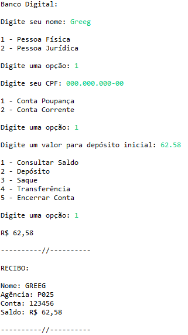

# POO - Desafio - Banco Digital
## Projeto Java
#### Por: DIO (Digital Innovation One)

### Sobre o Projeto

Um sistema bancário orientado a objetos que gerencia e armazena informações dos clientes, permitindo depósitos iniciais durante a abertura de conta, facilitando operações como consulta de saldo, depósitos, saques e transferências, e exibindo recibos para cada transação realizada.

##### About the project

An object-oriented banking system that manages and stores customer information, allowing initial deposits during account opening, facilitating operations such as balance inquiries, deposits, withdrawals and transfers, and displaying receipts for each transaction carried out.

### Diagrama de Caso de Uso
##### Use Case Diagram

")

### Diagrama de Classe
##### Class Diagram

")

### Organização do Projeto
##### Project Organization

")

### Ferramentas de Desenvolvimento
##### (Development Tools)

<table>
    <head>
        <tr><th>IDE</th><th>Versão</th><th>JDK</th></tr>
    </head>
    <body>
        <tr><td>Eclipse</td><td>2024-03</td><td>JDK (Java 17)</td></tr>        
    </body>
</table>

### Técnicas Utilizadas
##### (Techniques Used)

* Classe Scanner: Entrada
* Switch: Escolha
* Exception: Customizada/try/catch
* Orientação a Objetos

### Autor (Author)
#### Katarine Albuquerque
###### Desenvolvedora Front-end (Developer)
   
